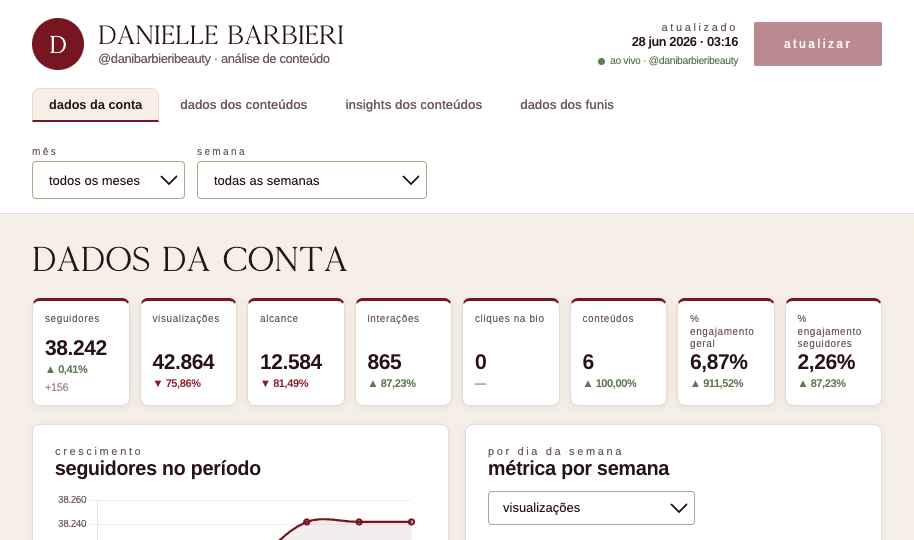

# Dashboard de Análise — Danielle Barbieri

Painel de análise de performance do Instagram **@danibarbieribeauty** e das campanhas de tráfego (Facebook/Meta Ads), com dados servidos ao vivo pelos conectores da **Windsor.ai**.



---

## O que é

Aplicação de **página única** que roda 100% no navegador, sem build/bundler. A interface é um único **Design Component** (`Dashboard.dc.html`) renderizado por um runtime React leve (`support.js`). Os gráficos usam **Chart.js**.

O painel tem quatro abas:

- **Dados da conta** — KPIs do período (seguidores, visualizações, alcance, interações, cliques na bio, conteúdos, % de engajamento) + gráficos de crescimento de seguidores e métricas por dia da semana.
- **Dados dos conteúdos** — grade de cards de todas as publicações, com capa, tipo, data, métricas estilo Instagram e taxas de engajamento/salvamento/compartilhamento.
- **Insights dos conteúdos** — média por post no período, top 3 conteúdos (métrica selecionável) e leituras de "o que funcionou / o que não funcionou" derivadas dos números.
- **Dados dos funis** — funis de investimento e tabelas de anúncios/conjuntos das campanhas **Sessão Premium** e **Diagnóstico** (Facebook Ads), com impressões → cliques → conversões e custos por etapa (CPM, CPC, etc.).

---

## Como rodar

É estático — basta servir os arquivos e abrir no navegador.

```bash
# qualquer servidor estático serve; ex.:
python3 -m http.server 8000
# depois acesse http://localhost:8000/  (redireciona para Dashboard.dc.html)
```

> Abrir o arquivo direto via `file://` pode falhar por causa do carregamento de módulos/fontes — prefira um servidor estático local ou o GitHub Pages.

O botão **Atualizar** busca os dados ao vivo nos conectores da Windsor.ai (Instagram + Facebook Ads). Sem rede, o painel mostra o último estado conhecido.

---

## Estrutura

```
.
├── index.html                 Redireciona para o dashboard (entrada p/ GitHub Pages)
├── Dashboard.dc.html          Aplicação — toda a UI e a lógica de dados
├── support.js                 Runtime do Design Component (React leve) — não editar
├── image-slot.js              Web component: placeholder de imagem arrastável (capas)
├── assets/
│   └── design-system/         Tokens de marca (cores, tipografia, fontes .otf/.ttf)
│       ├── tokens/*.css
│       ├── styles.css
│       ├── _ds_bundle.js
│       └── assets/fonts/
└── docs/
    └── ARQUITETURA.md         Referência técnica (modelo de dados, fórmulas, limitações)
```

---

## Fontes de dados

Conectores REST da **Windsor.ai** (a chave de API está embutida no cliente apenas para este painel privado):

- **Instagram** — perfil, série diária (views, alcance, interações), saldo de seguidores e publicações (`media_*`).
- **Facebook Ads** — campanhas com **SESSAO PREMIUM** e **DIAGNOSTICO** no nome: gasto, impressões, alcance, cliques, conversões, por anúncio e por conjunto.

Detalhes de campos, fórmulas e limitações conhecidas dos conectores estão em [`docs/ARQUITETURA.md`](docs/ARQUITETURA.md).

### Cache de publicações e capas

Para não rebaixar todo o histórico a cada atualização, o painel mantém um cache local (`localStorage`):

- **1ª carga** semeia ~180 dias de publicações; as atualizações seguintes buscam só os **últimos 30 dias** e mesclam com o cache.
- As **capas** dos posts desde **janeiro/2026** são baixadas e **embutidas como imagem** (JPEG reduzido) no cache, para continuarem aparecendo mesmo depois que as URLs assinadas do Instagram expirarem.

---

## Stack

HTML + React 18 (via runtime do Design Component) + Chart.js. Sem JSX, sem bundler, sem dependências de build.
